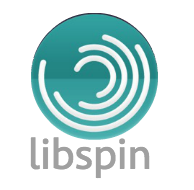

# libspin


自旋库是基于现代c++设计模式而产生的，目的是为了帮助c++生产者在更高层次进行设计开发，从而提供更好的抽象服务，提高项目开发效率。

# 代码示例
- Promise

```c++
#include "Parttern/Promise.h"

using namespace std;

int main()
{
    auto promise = make_promise([](auto promise, auto success, auto failure){
        if (promise.status == PromiseStatus::Resolved)
        {
            for (int i = 0; i < 1000; ++i)
            {
                cout << i << endl;
            }

            success(1);
        } else
        {
            failure(2);
        }
    });

    promise.Then([](int value){

        // success
        cout << "success: " << value << endl;

    }, [](int value){

        // failure
        cout << "failure: " << value << endl;
    });

    return 0;
}
```

- Maybe

```c++
using namespace std;

struct Person
{
    string* name;
};

int main()
{

    Person* p = new Person;
    p->name = new string("good boy");

    auto z = maybe(p)
        .With([](auto x) { return x->name; })
        .Do([](auto x) { cout << *x << endl; })
    ;

    return 0;
}
```


# 写在最后
如果喜欢请star，谢谢！
